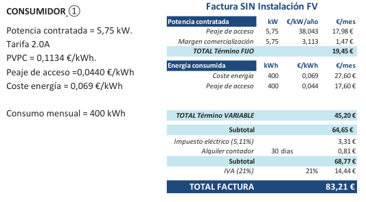

# Mecanismo de compensación de excedentes
## Informes

??? Abstract "Informe Dimensionado del sistema"

    ### Informe Dimensionado del sistema
    [{ loading=lazy }](https://eee1-uom5ariccq-ew.a.run.app/estudios/e_A_FV){ .md-button }
  <iframe hidden src="https://eee1-uom5ariccq-ew.a.run.app/estudios/e_A_FV" > </iframe>

??? Abstract "Informe Estimación del consumo"
    ### Informe Estimación del consumo
 

## Introduccion
En este anexo se presentan ejemplos de varias configuraciones de instalaciones de autoconsumo
tanto individual como colectivo a las que se aplica el mecanismo de compensación de excedentes,
mostrando el funcionamiento del mecanismo de compensación para ilustrar los ahorros que
podrían conseguirse con su aplicación.
Debe tener en cuenta que los ejemplos se realizan con la estructura actual de la tarifa eléctrica y
aplicando los peajes y cargos existentes en este momento. [ Actualmente se está revisando el REBT, enparticular lo referente a las ITC-BT-12 e ITC-BT-40 para adaptarloa los requisitos de autoconsumo. Losejemplos que se muestran en esta Guía se realizan únicamente a efectosdemostrativos sin perjuicio de losesquemas que finalmente sean aprobados.]

## "D.1 Autoconsumo individual CON excedentes y CON compensación, conectada en RED INTERIOR"
  En esta configuración existe un único consumidor asociado a la instalación en autoconsumo que, mientras tenga demanda, utilizará toda la energía producida por la instalación (fotovoltaica en el ejemplo) en cada momento. 

Existirán dos sujetos: productor y consumidor que podrán ser personas físicas o jurídicas diferentes.
Será necesario firmar un contrato de compensación de excedentes y comunicarlo a la compañía distribuidora, unque el productor y el consumidor sean la misma persona física o
jurídica. El propietario de la instalación, podrá ser una persona física o jurídica diferente del roductor y del consumidor. En aquellos momentos en que no precise utilizar toda la energía producida por a instalación de autoconsumo, los excedentes se volcarán a la red de distribución/transporte y se ompensarán al
final del mes.

### Documentación necesaria

### Contrato Compensación Excedentes:

PRODUCTOR – CONSUMIDOR 1

### Comunicación de modalidad de autoconsumo y envío Contrato de Compensación Excedentes:

CONSUMIDOR 1 - DISTRIBUIDORA/COMERCIALIZADORA

### ¿Cómo funciona la compensación?

En ciertas horas, cuando su consumo coincida con la generación fotovoltaica, el consumidor no
necesitará comprar energía a la red de forma que utilizará toda la energía generada por su
instalación de autoconsumo.
En otras horas, cuando su consumo sea inferior a la energía generada (ENG h) la energía sobrante
se volcará a la red como excedente, y habrá horas en que su consumo sea superior a la
generación y por tanto deba comprar energía de la red.
A final del periodo de facturación, la distribuidora leerá el contador de suministro, que será
bidireccional y que por tanto registrará tanto la energía consumida de la red como la energía
excedentaria vertida a la red. La distribuidora proporcionará a la comercializadora (CoR o libre)
toda la información de lectura necesaria para realizar la facturación y la compensación.
A la hora de realizar la facturación la comercializadora calculará el valor de la energía comprada a
la red (valorada a precio PVPC o a precio de mercado libre según el contrato de suministro que
tenga el consumidor), y le restará el valor de la energía vertida a la red como excedente (a precio
de mercado menos los desvíos o al precio acordado con la comercializadora también según sea el
contrato de suministro del consumidor).

#### Ejemplo del ahorro alcanzable

Es posible simular los ahorros que podrían alcanzarse con una instalación en autoconsumo en esta
configuración individual CON excedentes y CON compensación conectada en red interior.
Por simplificación se supone que el usuario tiene un contrato de suministro con una
comercializadora de referencia (CoR) con tarifa 2.0A a precio PVPC, de manera que los precios
utilizados en la simulación corresponden a medias horarias ponderadas del PVPC.
En este ejemplo el precio medio PVPC asciende a 113,965 €/MWh (donde 69,37 €/MWh son el
coste de energía y 44,03 €/MWh el peaje de acceso). Los valores del PVPC para cada hora pueden
consultarse en la página web de Red Eléctrica de España (REE).
Así, aplicando el mecanismo del artículo 14 del RD244/2019, al tener el contrato de suministro a
PVPC, los excedentes de este consumidor se valorarán al precio del mercado menos los desvíos.
Tomaremos un valor medio de 52 €/MWh para el mercado y 50 €/MWh para los excedentes.
En esta simulación se supone también que el consumidor utiliza parte de la energía generada por
la instalación fotovoltaica (FV), pero no es capaz de adaptar por completo su demanda con la
curva de generación solar y por ello, solo consigue que el 30% de su consumo proceda de la
fotovoltaica. Es decir, su coeficiente de simultaneidad entre su consumo y la generación será del
30%; por tanto, en algunas horas se generan excedentes ya que el consumidor no es capaz de
aprovechar la totalidad de esa energía generada.
Por último conviene recordar que al realizar la compensación de los excedentes, la cuantía a
descontar nunca podrá superar el valor económico de la energía consumida de la red.
En el ejemplo, el consumidor 1 antes de instalar su instalación de autoconsumo recibirá
mensualmente una factura eléctrica como la siguiente:

Si este consumidor decide instalar una instalación de autoconsumo CON excedentes y acogerse a
compensación, podemos realizar un análisis horario de sus consumos, autoconsumos y
generación de excedentes, que será de la siguiente forma:

El encargado de la lectura realiza en cada hora un saldo neto horario entre los consumos de red y
los excedentes, de manera que en una hora solo podrá haber excedentes o consumo de red,
independientemente de los flujos reales de energía que se hayan producido en esa hora. Es
decir, si la suma de excedentes en esa hora supera a la suma de los consumos, se asignará a esa
hora el saldo neto excedentario, mientras que si los consumos de red superan a los excedentes en
esa hora se asignará el saldo neto consumidor de red.
Este proceso se repetirá para todas las horas, de forma que al finalizar el periodo de facturación
(máximo 1 mes) se realizará la compensación de consumos de red y excedentes a los precios que
sean aplicables según el contrato del consumidor, y se generará una factura como la siguiente:

En el ejemplo, se ha supuesto que al final del
periodo de facturación, el consumidor ha reducido
su consumo de la red desde los 400 kWh iniciales
a solo 280 kWh ya que ha consumido el resto
(120kWh) de la instalación de autoconsumo.
Esos 280 kWh se pagan a precio PVPC.
Por otro lado, se han generado 380 kWh de
excedentes en ese mismo periodo, que se
compensan al precio descrito para excedentes.
Nótese que el valor de la compensación (19,00 €)
no podría superar el valor del coste de la energía
comprada en el mismo periodo (19,32 €).
En este caso la “cuantía por uso de red próxima”
no sería de aplicación ya que se trata de una
instalación conectada en red interior. [ En virtud del artículo 17.5 del RD 244/2019, la CMNC determinarála cuantía por la utilización de la red que
deban satisfacer los consumidores, en el caso en que se produzca transferencia de energía a través de lared
de distribución en instalaciones próximas a efectos de autoconsumo]
El ahorro en la factura eléctrica con autoconsumo
(41,79 €) respecto de la factura sin instalación de
autoconsumo (83,21 €) alcanza el 50%.
Si en lugar de optar por acogerse al mecanismo de compensación, este mismo consumidor con la
misma instalación de autoconsumo decidiese cambiar de modalidad y pasar a una instalación
CON excedentes pero NO ACOGIDA a compensación, es decir, a vender los excedentes en el
mercado, también se pueden simular los ahorros alcanzables
Por un lado, el consumidor recibe una factura eléctrica con menor consumo de la red ya que,
siguiendo el ejemplo anterior reduce la compra de energía a 280 kWh (autoconsume los mismos
120 kWh) que antes. Como ya no tiene compensación, no se le descuenta el valor de los 380 kW
de excedentes y tampoco le aplica el término referente a la cuantía.
Por otro lado, el productor venderá esos excedentes (380 kWh) al mercado a través de un
representante y se obtendrá por ellos el precio del mercado horario que corresponda (52€/kWh
en el ejemplo) y por esos servicios de representación se abonará un importe según el contrato.
Además el productor deberá hacerse cargo de las obligaciones fiscales/tributarias que le apliquen
como el pago del IVPEE del 7% sobre el valor de la energía producida y los costes por retribución
del operador del sistema (OS), que se aplicarán sobre los 380kWh vendidos.

En este caso, si el consumidor y el productor son la misma persona, por un lado se abonará la
factura de consumo una vez tomado en cuenta el valor de la compensación de los excedentes (1.)
y por otro lado se recibirá el importe de la venta (2.). A esa venta habrá que restarle los costes
ocasionados por la actividad de venta en el mercado (3. y 4.)
Así, el ahorro neto que se obtiene al introducir la instalación en autoconsumo alcanza el 47% si lo
comparamos con la factura eléctrica original sin instalación de autoconsumo (83,21€).

#### A tener en cuenta

Para lograr el máximo ahorro en el término variable de la factura es necesario que la instalación
de autoconsumo se dimensione adecuadamente, de forma que sea capaz de cubrir las
necesidades del consumidor. En el ejemplo, el consumidor tiene un consumo de 400 kWh y la
instalación se dimensiona para que produzca por encima de esa cantidad hasta 500 kWh.
Pero es aún más importante que el consumidor adapte su demanda a la curva de producción de la
instalación generadora, de manera que maximice el autoconsumo instantáneo de la energía FV y
por tanto genere los mínimos excedentes posibles.
En el ejemplo, el consumidor realmente sólo es capaz de autoconsumir el 30% de sus necesidades
de consumo. Si por el contrario el consumidor fuese capaz de modificar su perfil de demanda (por
ejemplo cambiando hábitos de consumo y desplazando su consumo a los momentos de mayor
generación fotovoltaica) el ahorro sería mucho mayor; si la energía autoconsumida fuera el total
de la producción FV (500 kWh), tendríamos el máximo ahorro en la factura (más del 60%).
Recuerde que el productor y el consumidor pueden ser personas físicas o jurídicas diferentes y
que, en caso de que se opte por la venta al mercado de los excedentes, será el productor quien
recibirá los ingresos de la venta y quien deberá hacerse cargo de los costes y obligaciones que
acompañen a dicha venta.

## D.2 "Autoconsumo colectivo CON o SIN excedentes y CON compensación, con todos los consumidores conectados en RED INTERIOR"

En esta configuración existen varios consumidores
asociados. La conexión se realiza en la red interior,
aguas arriba del contador de suministro de cada
consumidor.
En esta conexión se respetan las limitaciones para
edificios sujetos a la LPH, puesto que la instalación se
conecta en red interior pero no directamente a los
consumidores.
En la modalidad CON excedentes existirán dos
sujetos: productor y consumidores, que podrán ser
personas físicas o jurídicas diferentes. En la
modalidad SIN excedentes no existe productor.
La instalación de autoconsumo (FV en el ejemplo)
dispone de un contador bidireccional de generación
neta. Cada consumidor asociado dispone únicamente
de un contador, que será el de suministro, que
registrará la medida de toda la energía que llega a
cada consumidor. En la modalidad SIN excedentes
existe un sistema antivertido, que impide la cesión de
energía a la red.

Para poder acogerse a compensación la instalación de generación debe ser renovable y de P≤100
kW. Además, los consumos de servicios auxiliares deberán ser despreciables por lo que deberán
cumplirse las tres condiciones del artículo 3j) del RD244/2019.

### Documentación necesaria

Al ser una instalación de autoconsumo colectivo, es necesario que los consumidores asociados
firmen un acuerdo con los criterios de reparto de la energía en función de las (ß) que se acuerden.
Adicionalmente, al querer acogerse a compensación, será necesario firmar un contrato de
compensación simplificada entre productor y consumidores o un acuerdo de compensación
simplificada entre los consumidores, según sea CON o SIN excedentes, que contenga el mismo
acuerdo de reparto de la energía anterior.
Ambos documentos deben remitirse a la compañía distribuidora de forma individual por cada
consumidor y se le comunicará la modalidad de autoconsumo elegida.

### ¿Cómo funciona la compensación?

A final de mes, la distribuidora leerá el contador de generación neta horaria de la instalación de
autoconsumo (ENGh) y proporcionará a la comercializadora toda la información necesaria para
realizar la facturación y la compensación.
La comercializadora se encargará de realizar la facturación y la compensación de los excedentes a
cada consumidor individualmente, a partir de esa información y lo hará para cada hora dentro del
periodo de facturación.
Así para cada hora, la distribuidora:
-  Asigna la energía generada por la FV a cada consumidor en función de las ß fijas
  comunicadas:  $ENG_{h,i} = ß_i * ENG_h$.
- Compara la energía horaria individualizada $ENG_{h,i}$ que le corresponde a cada usuario con la
  lectura horaria de su contador individual de suministro (energía horaria consumida
  individualizada).
  Si la energía horaria consumida individualizada (en esa hora) es superior a la $ENG_{h,i}$ entonces
  el autoconsumo horario individualizado ($Eaut_{h,i}$) será la $ENG_{h,i}$.
  Con ello, lo que factura por energía consumida de la red (en esa hora) será la lectura horaria
  del contador menos $ENG_{h,i}$.
  Si la energía horaria consumida individualizada es inferior a la $ENG_{h,i}$ entonces lo que factura
  por energía de red (en esa hora) será 0 kWh, según se detalla en el Anexo I del RD 244/2019.
-  En las horas en las que no se consume toda la energía generada individualizada $ENG_{h,i}$ se
  generarán excedentes que serían susceptibles de ser compensados.
A final de mes tendremos un cierto consumo de red para cada consumidor, ya que habrá horas en
que $ENG_{h,i}$ no cubra el consumo horario individualizado. Todos los consumos horarios se suman.
Por otro lado se habrán generado excedentes, ya que habrá horas en que $ENG_{h,i}$ es mayor que el
consumo horario individualizado, de manera que todos los excedentes horarios se valoran a su
correspondiente precio horario y su valor se suma.
Los excedentes totales de cada consumidor asociado se compensarán en su factura de consumo
eléctrico, al final del periodo de facturación.

### Ejemplo del ahorro alcanzable

Es posible simular los ahorros que podrían alcanzarse con una instalación en autoconsumo en una
configuración colectiva SIN excedentes y CON compensación con todos los usuarios conectados
en RED INTERIOR.
Por simplificación se supone que existen dos usuarios y que ambos tienen un contrato de
suministro con una comercializadora de referencia a PVPC, de manera que los precios utilizados
en la simulación corresponden a medias horarias ponderadas del PVPC.
En el ejemplo se utiliza el mismo el precio medio PVPC del apartado anterior de 113,39 €/MWh
(incluido peaje).
Al suponer que ambos consumidores tienen contratado el suministro con una comercializadora
de referencia, el RD 244/2019 marca el precio al que deben ser valorados los excedentes que será
el precio medio del mercado diario e intradiario menos los desvíos. En el ejemplo tomamos para
este valor una cifra de 50 €/MWh.
Para el reparto de energía entre los consumidores asociados, se asignan los mismos ß para ambos
consumidores, ya que se ha supuesto que el criterio de reparto se realiza siguiendo la propuesta
del Anexo I del RD 244/2019 y que ambos consumidores tienen la misma potencia contratada
(5,75 kW), pero los ß podrían ser distintos si los consumidores acuerdan coeficientes distintos.
En el ejemplo, los consumidores 1 y 2 antes de instalar su instalación de autoconsumo
recibirán mensualmente sendas facturas eléctricas como las siguientes:

En este ejemplo, los consumidores deciden instalar una instalación de autoconsumo SIN
excedentes (dotada de un sistema antivertido) y acogerse a compensación.
Suponemos además que ambos consumidores tienen la misma potencia contratada y acuerdan el
coeficiente ß = 0,50.
Al tratarse de una instalación SIN excedentes, la producción se adaptará a los consumos
existentes en cada momento, ya que nunca puede volcarse energía a la red.

Al igual que en el ejemplo anterior, podemos realizar un análisis horario de los consumos,
autoconsumos y generación de excedentes, que será de la siguiente forma:

Este proceso se repetirá para todas las horas, de forma que al finalizar el periodo de facturación
se realizará la compensación de consumos de red y excedentes a los precios que sean aplicables
según el contrato de cada consumidor, y se recibirán unas facturas como las siguientes:

#### A tener en cuenta

La instalación generadora debe estar ajustada para que su generación pueda cubrir los consumos
totales de los consumidores asociados.
En este caso, al tratarse de una instalación SIN excedentes, el dimensionamiento adecuado toma
mayor importancia, puesto que la generación se adaptará al consumo por existir un mecanismo
anti-vertido, de manera que si no hay consumo no habrá generación.
La generación en cada hora será como máximo el consumo total de los consumidores conectados
aguas abajo de la generación, ya que es posible que en algún momento de esa hora la generación
no sea capaz de suministrar la energía demandada.
Lo ideal es que los consumidores acomoden su demanda a la generación FV, de manera que se
maximice el autoconsumo, puesto que es ahí donde se encuentra el ahorro más importante de la
factura. Cuanto más consumo horario se case con la generación horaria FV, mayor será el ahorro.
En este ejemplo el consumidor 1 consigue un ahorro del 38%, frente a un ahorro del 29% del
consumidor 2, debido a su mejor gestión de la demanda (maximizando el autoconsumo) lo que
implica menores excedentes.

##  D.3 "Autoconsumo colectivo CON excedentes y CON compensación, A TRAVÉS DE RED con al menos un consumidor conectado en RED INTERIOR"

En esta configuración existen varios consumidores asociados que se conectan a la instalación a
través de la red de distribución. Sin embargo, la instalación generadora se conecta a la red interior
(que incluye las instalaciones de enlace) de, como mínimo, uno de los consumidores asociados.
Al ser modalidad CON excedentes, existirán dos sujetos: productor y consumidores, que podrán ser
personas físicas o jurídicas diferentes. La instalación de autoconsumo (FV en el ejemplo)
dispone de un contador bidireccional de generación neta. Cada consumidor asociado dispone únicamente
de un contador, que será el de suministro, que registrará la medida de toda la energía que llega a
cada consumidor. Al tratarse de un autoconsumo colectivo, los consumidores asociados deberán acordar elcriterio de reparto de la energía que se genere y firmar el correspondiente “acuerdo de reparto” dondefigure el coeficiente β que le corresponde para cada consumidor. Este acuerdo se remitirá a ladistribuidora.

Esta configuración representa un autoconsumo colectivo donde la instalación generadora se ubica
en un edificio (polideportivo en el ejemplo), y se conecta en su red interior. Los consumidores
asociados se ubican en las cercanías, cumpliendo los criterios de distancia que establece el
RD244/2019 para los autoconsumos a través de red.
Además, esta configuración permite que los consumidores se acojan al mecanismo de
compensación simplificada ya que se pueden cumplir las condiciones descritas en el RD244/2019:
-  La fuente de energía primaria es renovable: en el ejemplo se cumple al tratarse de
  generación fotovoltaica.
-  La potencia total no sea superior a 100 kW.
-  El consumidor y productor asociado hayan suscrito un contrato de compensación de
  excedentes de autoconsumo.
-  La instalación de producción no tenga otorgado un régimen retributivo adicional o
  específico.
-  Si resultase necesario realizar un contrato de suministro para servicios auxiliares de
  producción, el consumidor haya suscrito un único contrato de suministro para el consumo
  asociado y para los consumos auxiliares de producción con una empresa comercializadora,
  según lo dispuesto en el artículo 9.2 del presente real decreto.
  En el ejemplo, al tratarse de una instalación fotovoltaica los consumos por servicios
  auxiliares podrían ser considerados despreciables, no siendo necesario formalizar el
  contrato de suministro para dichos servicios auxiliares y por tanto, cumpliéndose este
  apartado.
  Para que los consumos auxiliares se puedan considerar despreciables, deberán cumplirse
  tres condiciones a la vez que aparecen descritas en el artículo 3j) del RD244/2019:
  -  Sean instalaciones próximas de red interior. En la configuración de nuestro ejemplo, esta condición se cumpliría dado que la
    instalación se encuentra conectada a la red interior de uno de los consumidores
    asociados (el polideportivo del ejemplo).
    Como la generación está conectada a la red interior de al menos uno de los
    consumidores asociados, se entenderá cumplido el primero de los requisitos para
    considerar despreciables los servicios auxiliares de producción.
    Esta interpretación viene refrendada por las preguntas frecuentes (FAQ) publicadas
    por el Ministerio para la Transición Ecológica y el Reto Demográfico sobre
    autoconsumo que pueden consultarse en su [página web](https://energia.gob.es/electricidad/autoconsumo-electrico/Paginas/autoconsumo.aspx)
  -  Se trate de instalaciones de generación con tecnología renovable destinadas a para
    suministrar a uno o más consumidores acogidos a cualquiera de las modalidades de
    autoconsumo y su potencia instalada sea menor de 100 kW.
    Esta condición se cumpliría para cualquier instalación renovable (FV en el ejemplo)
    con la potencia inferior a 100kW.
  -  En cómputo anual, la energía consumida por dichos servicios auxiliares de producción
    sea inferior al 1 % de la energía neta generada por la instalación.
    Esta condición se cumpliría para nuestro ejemplo, ya que las instalaciones
    fotovoltaicas, en líneas generales, presentan consumos auxiliares inferiores a este 1%.
Estas configuraciones de autoconsumo colectivo a través de red acogidas a compensación
resultan especialmente interesantes para aplicaciones de índole social en ayuntamientos y
entidades públicas/privadas como mecanismos de lucha contra la pobreza energética.
Permiten utilizar espacios que teniendo gran superficie de tejado disponible, pueden compartir la
generación con otros consumidores que, por ejemplo, no dispusiesen de tejado adecuado o
estuviesen en situación de pobreza energética. Además, se permite que los consumidores
compensen sus excedentes haciendo el autoconsumo más atractivo y ampliando, en su caso, el
carácter social de la instalación.
Otro ejemplo de esta misma configuración de instalación colectiva CON excedentes conectada A
TRAVÉS de red y ACOGIDA a compensación, puede verse en la siguiente figura.
Existen varios consumidores asociados que se conectan a la instalación a través de la red de
distribución (los dos consumidores en residencias unifamiliares). La instalación generadora se ubica
en un edificio sujeto a LPH, por lo que se conecta a la red interior, en las instalaciones de enlace de
esos consumidores.
La instalación de autoconsumo (FV en el ejemplo) dispone de un contador bidireccional de generación neta y ada consumidor asociado dispone de su contador de suministro. Al tratarse de un autoconsumo colectivo, os consumidores asociados deberán acordar el criterio de reparto en el correspondiente “acuerdo de eparto” donde figuren los coeficientes β. El resto de condiciones se mantienen en este
ejemplo, por lo que los consumidores “externos” al edificio deberán cumplir los criterios de distancia del rtículo 3g).

Esta configuración al igual que en la de la figura 25, permite que los consumidores se acojan al
mecanismo de compensación simplificada ya que se pueden cumplir las condiciones descritas en
el RD244/2019.
En la configuración de nuestro ejemplo, esta condición se cumpliría dado que la instalación se
encuentra conectada a la red interior de al menos uno de los consumidores asociados.
En este ejemplo, la generación se conecta a las instalaciones de enlace del edificio, que a efectos
del RD244/2019 tienen la consideración de red interior. Así, al estar la generación conectada a la
red interior de al menos uno de los consumidores asociados, se cumple el primero de los
requisitos y los servicios auxiliares de producción despreciables se entienden despreciables.
Cuando además de lo anterior, se cumplan el resto de requisitos regulados en el artículo 3.j) del
Real Decreto 244/2019, de 5 de abril, no será necesario suscribir un contrato de suministro
particular para los servicios auxiliares, posibilitando así el cumplimiento de la condición relativa a
la unicidad de contrato de suministro para poder acogerse a la modalidad de autoconsumo con
excedentes y compensación.

## Enlaces
- [Guía profesional de tramitación del autoconsumo ](https://www.idae.es/publicaciones/guia-profesional-de-tramitacion-del-autoconsumo)
- [Preguntas frecuentes sobre autoconsumo](https://energia.gob.es/electricidad/autoconsumo-electricoPaginas/preguntas-frecuentes-autoconsumo.aspx)
- [Plan de Recuperación, Transformación y Resiliencia](https://planderecuperacion.gob.es/)
