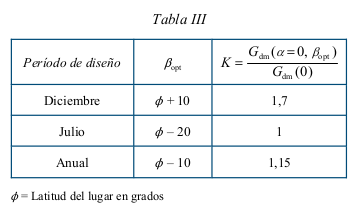
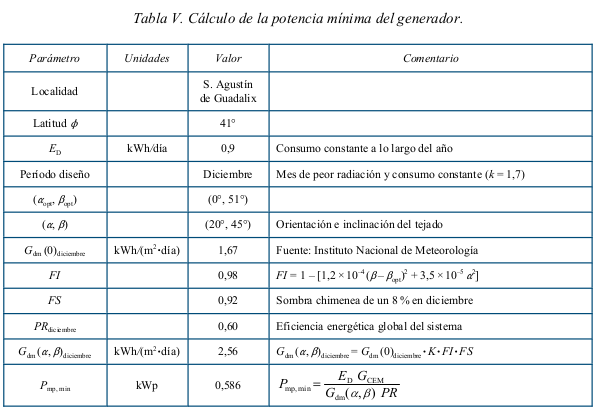
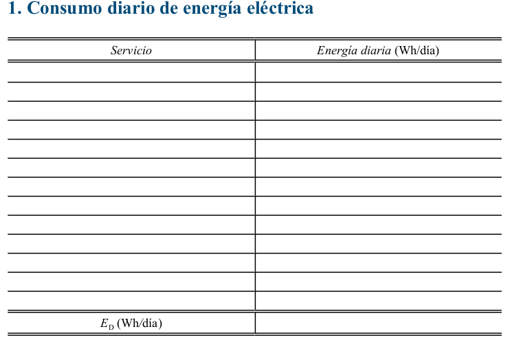

# Instalacion FV.

## Informes

??? Abstract "Informe Dimensionado del sistema"

    ### Informe Dimensionado del sistema
    [{ loading=lazy }](https://eee1-uom5ariccq-ew.a.run.app/estudios/e_A_FV){ .md-button }
  <iframe hidden src="https://eee1-uom5ariccq-ew.a.run.app/estudios/e_A_FV" > </iframe>

??? Abstract "Informe Estimación del consumo"
    ### Informe Estimación del consumo
 

## DIMENSIONADO DEL SISTEMA FOTOVOLTAICO 

### I. Estimación del consumo diario de energía

#### 1 Generalidades

* 1.1 La estimación correcta de la energía consumida por el sistema fotovoltaico sólo es sencilla en
  aquellas aplicaciones en las que se conocen exactamente las características de la carga (por
  ejemplo, sistemas de telecomunicación). Sin embargo, en otras aplicaciones, como puede ser la
  electrificación de viviendas, la tarea no resulta fácil pues intervienen multitud de factores que
  afectan al consumo final de electricidad: tamaño y composición de las familias (edad, formación,
  etc.), hábitos de los usuarios, capacidad para administrar la energía disponible, etc.

* 1.2 El objeto de este apartado es estimar la energía media diaria consumida por el sistema, E D
  (Wh/día).

* 1.3 El cálculo de la energía consumida incluirá las pérdidas diarias de energía causadas por el
  autoconsumo de los equipos (regulador, inversor, etc.).

* 1.4 El consumo de energía de las cargas incluirá el servicio de energía eléctrica ofrecido al usuario
  para distintas aplicaciones (iluminación, TV, frigorífico, bombeo de agua, etc.).

* 1.5 Para propósitos de dimensionado del acumulador, se calculará el consumo medio diario en
  Ah/día, L D , como:

  

  donde V NOM (V) es la tensión nominal del acumulador.

* 1.6 Los parámetros requeridos en la Memoria de Solicitud para una aplicación destinada al bombeo
  de agua serán calculados por el instalador usando los métodos y herramientas que estime
  oportunos. En su defecto, el apartado 2 describe un procedimiento aproximado de cálculo que
  permite considerar las características dinámicas del pozo.

#### 2 Bombeo de agua

##### 2.1 Definiciones

* 2.1.1 Altura de fricción: H f (m).
  Contribución equivalente en altura de las pérdidas por fricción en las tuberías para un caudal
  determinado.
* 2.1.2 Altura del depósito: H D (m).
  Altura entre el depósito de agua y el suelo.
* 2.1.3 Altura total equivalente: H TE (m).
  Altura fija (constan
* 2.1.4 Volumen diario de agua requerido: Q d (m 3 /día).
  Cantidad de agua que debe ser bombeada diariamente por el sistema fotovoltaico.
* 2.1.5 Caudal medio o aparente: Q AP (m 3 /h).
  Valor medio del volumen diario de agua requerido (Q AP = Q d / 24).
* 2.1.6 Eficiencia de la motobomba: 0 MB .
  Cociente entre la energía hidráulica y la energía eléctrica consumida por la motobomba.
* 2.1.7 Energía eléctrica consumida por la motobomba: E MB (Wh/día).
* 2.1.8 Energía hidráulica: E H (Wh/día).
  Energía necesaria para bombear el volumen diario de agua requerido.
* 2.1.9 Prueba de bombeo.
  Experimento que permite determinar el descenso de nivel de agua de un pozo al extraer un
  determinado caudal de prueba. Mediante este ensayo de bombeo se caracteriza el pozo con la
  medida de tres parámetros:
  * – Nivel estático del agua: H ST (m).
    Distancia vertical entre el nivel del suelo y el nivel del agua antes de la prueba de
    bombeo.
  * – Nivel dinámico del agua: H DT (m).
    Distancia vertical entre el nivel del suelo y el nivel final del agua después de la prueba
    de bombeo.
  * – Caudal de prueba: Q T (m 3 / h).
    Caudal de agua extraído durante la prueba de bombeo.

##### 2.2 Cálculo de la energía eléctrica requerida por la motobomba

* 2.2.1 Se estimará la energía eléctrica consumida por la motobomba como:
  
* 2.2.2 Para sistemas de bombeo de corriente alterna, la eficiencia de la motobomba es un parámetro
  que suele estar incluido en el rendimiento del conjunto inversor-motobomba. Habitualmente,
  el fabricante proporciona herramientas gráficas para el cálculo del rendimiento global del
  sistema, incluyendo el propio generador fotovoltaico. Por defecto, puede utilizarse un
  rendimiento típico 0 MB = 0,4 para bombas superiores a 500 W.
* 2.2.3 La altura equivalente de bombeo, H TE , es un parámetro ficticio que incluye las características
  físicas del pozo y del depósito, las pérdidas por fricción en las tuberías (contribución
  equivalente en altura) y la variación del nivel dinámico del agua durante el bombeo. Para su
  cálculo puede utilizarse la fórmula siguiente:

La suma de los dos primeros términos es la altura desde la salida de la bomba en el depósito
hasta el nivel estático del agua (figura 3). El tercer término es una corrección para tener en
cuenta el descenso de agua durante el bombeo y el cuarto es la contribución equivalente en
altura de las pérdidas por fricción en las tuberías y en otros accesorios del sistema hidráulico
(válvulas, codos, grifos, etc.). Estas pérdidas, de acuerdo con el PCT, serán inferiores al 10 %
de la energía hidráulica útil (es decir, H f < 0,1H TE ).

### II. Dimensionado del sistema

#### 1 Generalidades

* 1.1 El objeto de este apartado es evaluar el dimensionado del generador fotovoltaico llevado a cabo
  por el instalador, con independencia de los métodos que el instalador utilice para esta tarea.
* 1.2 Para ello se le pedirá que indique la eficiencia energética esperada para la instalación.

#### 2 Definiciones

* 2.1 Ángulo de inclinación $ .

Ángulo que forma la superficie de los módulos con el plano horizontal (figura 1). Su valor es
0° para módulos horizontales y 90° para verticales.

* 2.2 Ángulo de azimut " .
  Ángulo entre la proyección sobre el plano horizontal de la normal a la superficie del módulo y
  el meridiano del lugar (figura 2). Valores típicos son 0° para módulos orientados al sur, –90°
  para módulos orientados al este y +90° para módulos orientados al oeste.
* 
* 2.3 G dm (0).
  Valor medio mensual o anual de la irradiación diaria sobre superficie horizontal en kWh/(m 2 A día).
* 2.4 G dm ( " opt ,  opt ).
  Valor medio mensual o anual de la irradiación diaria sobre el plano del generador orientado de
  forma óptima ( " opt , $ opt ), en kWh/(m 2 A día). Se considera orientación óptima aquella que hace que
  la energía colectada sea máxima en un período.
* 2.5 G dm ( " ,  ).
  Valor medio mensual de la irradiación diaria sobre el plano del generador en kWh/(m 2 A día) y
  en el que se hayan descontado las pérdidas por sombreado.
  2.6 Factor de irradiación (FI).
  Porcentaje de radiación incidente para un generador de orientación e inclinación ( " ,  ) respecto
  a la correspondiente para una orientación e inclinación óptimas ( " = 0°, $ opt ). Las pérdidas de
  radiación respecto a la orientación e inclinación óptimas vienen dadas por (1 – FI).
* 2.7 Factor de sombreado (FS).
  Porcentaje de radiación incidente sobre el generador respecto al caso de ausencia total de
  sombras. Las pérdidas por sombreado vienen dadas por (1 – FS).
* 2.8 Rendimiento energético de la instalación o “performance ratio”, PR.
  Eficiencia de la instalación en condiciones reales de trabajo para el período de diseño, de
  acuerdo con la ecuación:
  
  Este factor considera las pérdidas en la eficiencia energética debido a:
  * La temperatura.
  * El cableado.
  * Las pérdidas por dispersión de parámetros y suciedad.
  * Las pérdidas por errores en el seguimiento del punto de máxima potencia.
  * La eficiencia energética, 0 rb , de otros elementos en operación como el regulador,
  * batería, etc.
  * – La eficiencia energética del inversor, 0 inv .
  * – Otros.
    Valores típicos son, en sistemas con inversor, PR • 0,7 y, con inversor y batería, PR • 0,6. A
    efectos de cálculo y por simplicidad, se utilizarán en sistemas con inversor PR = 0,7 y con
    inversor y batería PR = 0,6. Si se utilizase otro valor de PR, deberá justificarse el valor elegido
    desglosando los diferentes factores de pérdidas utilizados para su estimación.
    En caso de acoplo directo de cargas al generador (por ejemplo, una bomba), se

#### 3 Procedimiento

##### 3.1 Período de diseño

Se establecerá un período de diseño para calcular el dimensionado del generador en función de
las necesidades de consumo y la radiación. Se indicará cuál es el período para el que se realiza
el diseño y los motivos de la elección. Algunos ejemplos son:

* – En escenarios de consumo constante a lo largo del año, el criterio de “mes peor”
  corresponde con el de menor radiación.
* – En instalaciones de bombeo, dependiendo de la localidad y disponibilidad de agua, el
  “mes peor” corresponde a veces con el verano.
* – Para maximizar la producción anual, el período de diseño es todo el año.

##### 3.2 Orientación e inclinación óptimas. Pérdidas por orientación e inclinación

Se determinará la orientación e inclinación óptimas ( " = 0°,  opt ) para el período de diseño
elegido. En la tabla III se presentan períodos de diseño habituales y la  correspondiente
inclinación ( $\beta$ ) del generador que hace que la colección de energía sea máxima.

El diseñador buscará, en la medida de lo posible, orientar el generador de forma que la energía
captada sea máxima en el período de diseño ( " = 0°, $ opt ). Sin embargo, no será siempre posible
orientar e inclinar el generador de forma óptima, ya que pueden influir otros factores como son
la acumulación de suciedad en los módulos, la resistencia al viento, las sombras, etc. Para
calcular el factor de irradiación para la orientación e inclinación elegidas se utilizará la expresión
aproximada:

##### 3.3 Irradiación sobre el generador

Deberán presentarse los siguientes datos:

* G dm (0)
  Obtenida a partir de alguna de las siguientes fuentes:
  – Instituto Nacional de Meteorología
  – Organismo autonómico oficial

* G dm ( " ,  )
  Calculado a partir de la expresión:

  
  Este parámetro puede obtenerse de la tabla III para el período de diseño elegido.

##### 3.4 Dimensionado del generador

El dimensionado mínimo del generador, en primera instancia, se realizará de acuerdo con los
datos anteriores, según la expresión:

Para el cálculo, se utilizarán los valores de PR especificados en el punto 2.8 de este anexo.

##### 3.5 Diseño del sistema

El instalador podrá elegir el tamaño del generador y del acumulador en función de las
necesidades de autonomía del sistema, de la probabilidad de pérdida de carga requerida y
cualquier otro factor que quiera considerar, respetando los límites estipulados en el PCT:

* –La potencia nominal del generador será, como máximo, un 20 % superior al valor
  P mp, min para el caso general (ver 4.2.4 de este PTC).
* – La autonomía mínima del sistema será de tres días.
* – Como caso general, la capacidad nominal de la batería no excederá en 25 veces la
  corriente de cortocircuito en CEM del generador fotovoltaico.
  La autonomía del sistema se calculará mediante la expresión:

#### III. Ejemplo de cálculo

##### 1 Estudio de la carga

Se pretende electrificar una vivienda rural de una familia formada por 4 personas, situada en el
término municipal de San Agustín de Guadalix (latitud = 41°). El servicio de energía eléctrica
ofrecido a los usuarios está recogido en la tabla IV. El servicio proporcionado incluye la
electrificación de la vivienda y un sistema de bombeo de agua (para uso personal y una pequeña
granja).
Las pérdidas de autoconsumo de los equipos incluyen las del regulador (24 h × 1 W = 24 Wh)
y las del inversor, para el que se ha estimado que funcionará 11 horas en vacío con un consumo
medio de 2 W (11 h × 2W = 22 Wh).
Tabla IV. Consumo diario de energía eléctrica.

La bomba de agua extrae diariamente 1500 litros de un pozo (figura 3), cuya altura equivalente de
bombeo se ha estimado en 20 metros, con una motobomba que tiene un rendimiento energético del
40 %. La prueba de bombeo realizada al pozo permitió obtener los siguientes parámetros:
H ST = 15 metros
H DT = 30 metros

(*) La utilización de C 20 en lugar de la C 100 lleva a sobredimensionar el acumulador un 25 %, pero se compensa con la
pérdida de capacidad con el tiempo.

Como se puede comprobar, el factor que corrige la variación dinámica del nivel del pozo es
insignificante frente a la altura entre el nivel estático del agua y el depósito, debido a que el
caudal bombeado es pequeño.

##### 2 Diseño del sistema

Para diseñar el generador se dispone de un módulo fotovoltaico cuyos parámetros en CEM
tienen los siguientes valores:

* Potencia máxima = 110 Wp

* Corriente de cortocircuito = 6,76 A

* Corriente en el punto de máxima potencia = 6, 32 A

* Tensión de circuito abierto = 21,6 V

* Tensión en el punto de máxima potencia = 17,4 V

  

  

  Se elige un generador de 660 Wp (formado por dos módulos en serie y tres ramas en paralelo)
  y un acumulador con una capacidad nominal de 340 Ah en 20 horas. La tensión nominal del
  sistema es de 24 V. Ambos valores se han elegido para asegurar una probabilidad de pérdida de
  carga inferior a 10 –2 (*).
  Las tensiones del regulador se ajustan de forma que la profundidad de descarga máxima sea del
  70 %.
  La eficiencia energética del inversor se estima en el 85 %, y la del regulador + acumulador en
  el 81 %.

  

## DOCUMENTACIÓN QUE SE DEBE INCLUIR EN LAS MEMORIAS

### 1. Consumo diario de energía eléctrica

### 2. Sistemas de bombeo de agua

### 3. Dimensionado del generador

### 4. Dimensionado final del sistema

## Referencias: 

[Pliego de Condiciones Técnicas de Instalaciones Conectadas a Red .PCT-C-REV - julio 2011  (*)](https://www.idae.es/publicaciones/instalaciones-de-energia-solar-fotovoltaica-pliego-de-condiciones-tecnicas-de) y [PCT-A-REV - febrero 2009 ](./Instalacion_FV.assets/Aisladas. Pliego de condiciones PCT-A_2009.pdf))
