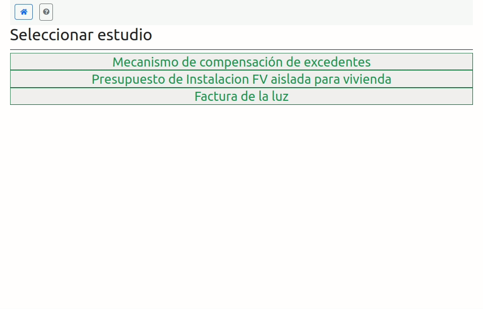
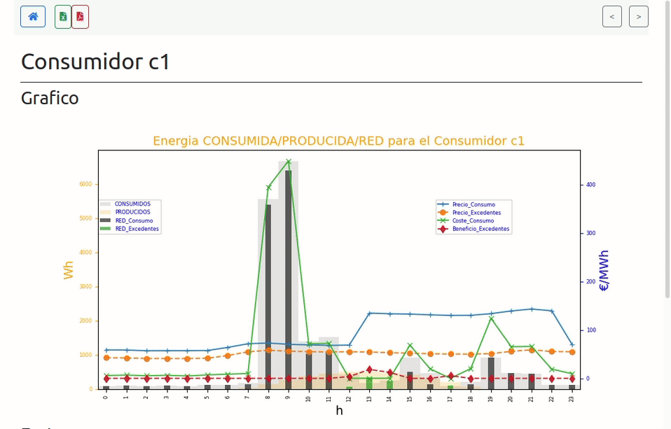
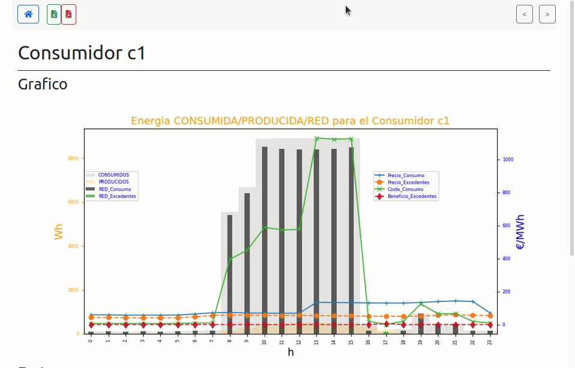

# Funcionamiento de la aplicacion

La aplicacion genera informes de estudios predeterminados a partir de archivos excel (.xlsx) editables desde  la web o con excel.

​    

??? "1.- Editar los parametros en el navegador (disponible para Insiders )"
    

??? "2.- Editar los parametros con excel e importarlos."
    

??? "3.- Sacar el informe"
    

